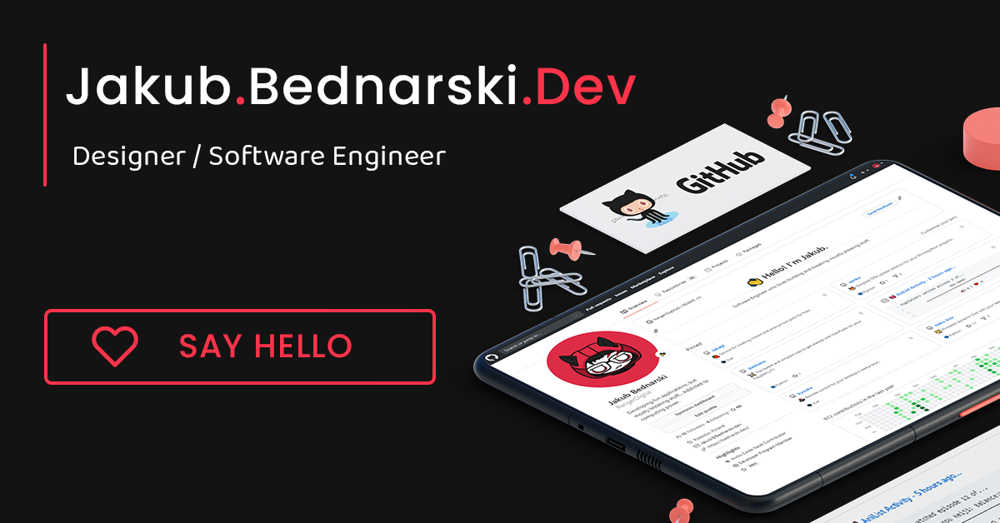

   

---

Source code of the second iteration of my personal / portfolio site. Build using **Vue.js**, **FullPage.js**, and **Anime.js**.

 

> 💖 Got your attention? Great, Check it out live [here!](https://bednarski.dev/)

 

## 🚧 Contributing

**You are more than welcome to help me improve this site!**

Just fork this project from the `master` branch and submit a Pull Request (PR).

 

## 📃 License

This project is licensed under [GPL-3.0](https://choosealicense.com/licenses/gpl-3.0/) .
